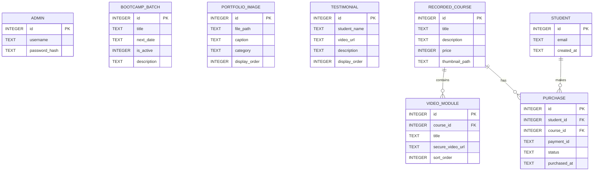

# Database Data Model: Photography Academy Portfolio & E-Learning Platform

This document describes the SQLite schema, key entities, validations, and state transitions for the photography academy platform.

---

## 1. Schema Diagram & Relationships



---

## 2. Entity Descriptions

### `admins`
Stores credentials for the administrator dashboard.
*   `id`: Primary Key (Autoincrement).
*   `username`: Text, Unique.
*   `password_hash`: Text, secure hash of the password.

### `bootcamp_batches`
Represents the high-ticket intensive programs shown on the homepage.
*   `id`: Primary Key (Autoincrement).
*   `title`: Text, not null (e.g. "Photography Bootcamp", "Cinematography Bootcamp").
*   `next_date`: Text, not null (e.g. "25 JULY"). Can be any display text managed by the instructor.
*   `is_active`: Integer (Boolean: 0 = registration closed, 1 = registration open).
*   `description`: Text, details of the course syllabus and perks.

### `portfolio_images`
Contains paths to high-resolution creative works showcased on the front page.
*   `id`: Primary Key (Autoincrement).
*   `file_path`: Text, not null (relative path or URL to hosted asset).
*   `caption`: Text.
*   `category`: Text (e.g. "Cinematography", "Landscape", "Portrait").
*   `display_order`: Integer, defaults to 0. Used for custom positioning.

### `testimonials`
Links to YouTube/Vimeo student review video embeds.
*   `id`: Primary Key (Autoincrement).
*   `student_name`: Text, not null.
*   `video_url`: Text, not null (Vimeo/YouTube embed URL).
*   `description`: Text, short quote.
*   `display_order`: Integer.

### `recorded_courses`
Bite-sized digital video products available for instant checkout.
*   `id`: Primary Key (Autoincrement).
*   `title`: Text, not null.
*   `description`: Text.
*   `price`: Integer, price in INR (stored in subunits, i.e., paise, e.g., 99900 for ₹999.00).
*   `thumbnail_path`: Text.

### `video_modules`
Individual lectures within a recorded course.
*   `id`: Primary Key (Autoincrement).
*   `course_id`: Foreign Key referencing `recorded_courses.id`.
*   `title`: Text, not null.
*   `secure_video_url`: Text, not null. Represents the Bunny.net/Vimeo video ID or secure embed path.
*   `sort_order`: Integer, order of presentation.

### `students`
Registered learners who log in using email magic links.
*   `id`: Primary Key (Autoincrement).
*   `email`: Text, Unique, lowercase, validated email format.
*   `created_at`: Text (ISO 8601 Timestamp).

### `purchases`
Binds students to courses after successful checkout.
*   `id`: Primary Key (Autoincrement).
*   `student_id`: Foreign Key referencing `students.id`.
*   `course_id`: Foreign Key referencing `recorded_courses.id`.
*   `payment_id`: Text, transaction identifier from payment gateway (Razorpay payment ID).
*   `status`: Text, defaults to 'pending'. Values: `'pending'`, `'completed'`, `'failed'`.
*   `purchased_at`: Text (ISO 8601 Timestamp).

---

## 3. Validation Rules

*   **Pricing**: All prices in `recorded_courses` must be positive integers representing amount in paise (minimum value: `100` representing ₹1.00).
*   **Email**: `students.email` must be validated using a strict regex for standard email syntax.
*   **Testimonial URLs**: `video_url` must match standard YouTube (`youtube.com/embed/...` or `youtu.be/...`) or Vimeo (`player.vimeo.com/video/...`) embed format rules.
*   **Batch Registration Toggle**: If `is_active` is 0, the public page must replace the WhatsApp CTA link with a "Registrations Closed" banner.

---

## 4. State Transitions

### Course Purchase Flow

```mermaid
stateDiagram-Obj
    [*] --> PENDING : Payment Session Initiated
    PENDING --> COMPLETED : Webhook Success (Razorpay checkout complete)
    PENDING --> FAILED : Webhook Error / Expiry / Cancelled
    COMPLETED --> [*] : Grant Secure Video Stream Access
    FAILED --> [*] : Block Video Access
```

*   **Session Initiation**: A student clicks purchase, creating a `PENDING` transaction.
*   **Completion**: Gateway sends webhook verification. Transaction transitions to `COMPLETED`. Next.js unlocks access to the corresponding `video_modules` table rows for the logged-in student.
*   **Failure**: If a checkout session expires or fails, the transaction moves to `FAILED`. Access is not granted.
